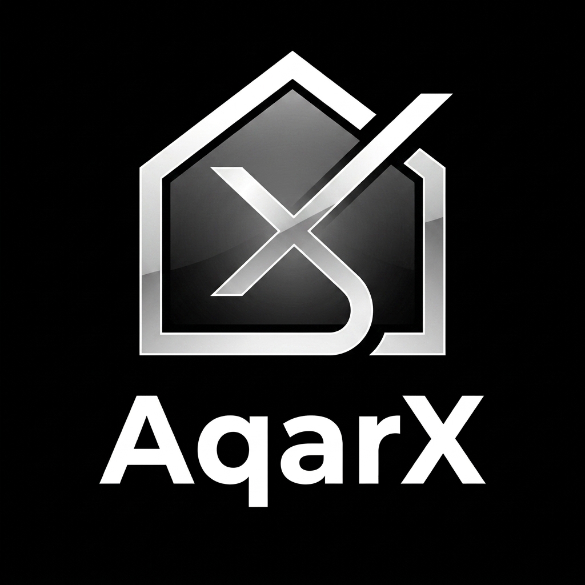

<div align="center">

# AqarX

## The Complete Smart Real Estate Ecosystem

**From an educational graduation ject ➜ to a market-ready commercial duct**

[]()
[]()
[]()

</div>

---

## 📖 Table of Contents

1. [Executive Summary](#1-executive-summary)
2. [Vision & The blem We Solve](#2-vision--the-blem-we-solve)
3. [Business Model](#3-business-model)
4. [Actors & User Roles](#4-actors--user-roles)
5. [Full Feature Map](#5-full-feature-map)
6. [Maintenance Module — The New Full Vertical](#6-maintenance-module--the-new-full-vertical)
7. [Technical Architecture](#7-technical-architecture)
8. [Tech Stack](#8-tech-stack)
9. [Database Design (ERD & Entities)](#9-database-design-erd--entities)
10. [Core Business Workflows](#10-core-business-workflows)
11. [Critical Business Logic](#11-critical-business-logic)
12. [Security & Compliance](#12-security--compliance)
13. [Performance & Scalability](#13-performance--scalability)
14. [Pricing & Revenue Model](#14-pricing--revenue-model)
15. [Phased Development Roadmap](#15-phased-development-roadmap)
16. [posed ject Structure](#16-posed-ject-structure)
17. [Why AqarX  Outperforms Any Competing ject](#17-why-aqarx--outperforms-any-competing-ject)

---

## 1. Executive Summary

**AqarX ** is a fully integrated real estate platform (a two-sided marketplace) connecting:

- **Real Estate Companies** that own or manage perties and want to list, sell, or rent them efficiently.
- **Users** looking to buy, rent, or even get **maintenance** for a perty they already have.

The ject moves away from the original three-role, tightly-coupled model (Admin / Owner / Tenant) toward a simplified, commercially stronger model:

> **Admin (platform) ⇄ Company (perty vider) ⇄ User (end customer)**

Alongside this, a brand-new business vertical is introduced: the **Maintenance Marketplace**, turning AqarX from a simple "perty listing site" into a **complete real estate services ecosystem** (Search → Buy/Rent → Move-in → Maintain).

---

## 2. Vision & The blem We Solve

| Current Market blem | AqarX 's Solution |
|---|---|
| Listing sites only show perties and drop the customer after booking | Full lifecycle tracking from search to move-in to maintenance |
| No reliable identity verification for real estate companies | KYC/KYB verification with official documents and a "Verified ✅" badge |
| Hard to find a trustworthy maintenance technician after buying/renting | A fully built-in maintenance marketplace inside the same platform |
| No structured direct negotiation or communication | Real-time chat between the user and the company |
| No financial decision-support tools | Built-in mortgage calculator and side-by-side perty comparison |
| No loyalty system to drive repeat usage | A points-based loyalty & rewards gram |

**duct Vision:** AqarX  becomes the **"super-app" of real estate** in the local market — one platform for everything perty-related: search, booking, financing, verification, and maintenance.

---

## 3. Business Model

### 3.1 Marketplace Sides

```
        ┌─────────────────────────┐
        │        AqarX           │
        │   (Platform / Admin)      │
        └────────┬────────┬────────┘
                 │        │
      ┌──────────▼──┐  ┌──▼───────────┐
      │  COMPANY     │  │    USER      │
      │ (Supply Side) │  │ (Demand Side)│
      │ Lists &       │  │ Searches /   │
      │ manages units │  │ books /      │
      │               │  │ requests     │
      │               │  │ maintenance  │
      └──────────────┘  └──────────────┘
              │                 │
              └────────┬────────┘
                        │
              ┌─────────▼──────────┐
              │  MAINTENANCE HUB    │
              │ (Technicians/Firms)  │
              └─────────────────────┘
```

### 3.2 Revenue Streams

1. **Company Subscriptions (SaaS)** — monthly/annual tiers (Basic, , Enterprise) based on unit count, media limits, and featured listings.
2. **Commissions** — a percentage of every confirmed booking/sale made through the platform.
3. **Featured Listings / motions (Boosting)** — paid placement at the top of search results or the homepage.
4. **Maintenance Take Rate** — a commission on the value of every completed maintenance job booked through the platform.
5. **Add-on Paid Services** — fessional photography, 360° virtual tours, perty valuation reports.
6. **B2B Advertising** — mortgage banks, insurance companies, and moving/furniture companies advertising their offers to users.

---

## 4. Actors & User Roles

### 4.1 Simplification: From 3 Roles to 2 Core Roles + Backend Governance

| Role | Description | Who Uses It |
|---|---|---|
| **Super Admin** | Runs the entire platform from behind the scenes (never public-facing): apves companies, monitors payments, manages subscription plans, resolves disputes | AqarX operations team |
| **Company** *(first requested role)* | A verified entity (real estate company / developer / broker) that lists and manages perties, with an internal team and tiered permissions | Real estate companies & brokers |
| **User** *(second requested role)* | One unified role for anyone searching for a perty **or** requesting maintenance — instead of the old "Owner/Tenant" split, everyone is a "User" with a dynamic status (searcher / current tenant / perty owner needing maintenance) | General public |

> 💡 **Key design note:** Instead of two separate tables (`Owner`, `Tenant`) as in the original design, there is now **one `User` table** (with an `Individual` UserType), while the company has its own `Company` entity with business-specific fields (commercial registration, tax number, logo, number of branches...). This simplifies the codebase and reduces the table count by roughly 30%.

### 4.2 Sub-permissions Inside "Company" (Team Roles)

Since a company is an entity rather than a single person, it needs internal permission tiers:

| Sub-role | Description |
|---|---|
| **Company Owner** | Account holder — manages the team, subscription, and billing |
| **Company Manager** | Manages perties and internal apvals |
| **Company Agent (Sales)** | Adds perties and follows up on booking requests only |

### 4.3 The Maintenance Service Source

| Role | Description |
|---|---|
| **Maintenance vider** | A registered technician/maintenance company (independent from the real-estate "Company") — receives maintenance requests, submits quotes, and performs the work |

### 4.4 Full Permission Matrix

| Module | Super Admin | Company | User | Maintenance vider |
|---|:---:|:---:|:---:|:---:|
| Browse / Search perties | ✅ | ✅ | ✅ | ✅ |
| Create / Edit / Delete own perty | ✅ | ✅ (own only) | ❌ | ❌ |
| Apve / Reject perties | ✅ | ❌ | ❌ | ❌ |
| Verify Company Account (KYB) | ✅ | ⏳ requests | ❌ | ❌ |
| Manage Company Team | ❌ | ✅ | ❌ | ❌ |
| Subscribe to a Plan | ❌ | ✅ | ❌ | ✅ (maintenance plans) |
| Manage motions | ✅ | ✅ (own) | ❌ | ✅ (own) |
| Book a perty / Pay Deposit | ❌ | ❌ | ✅ | ❌ |
| Request a Maintenance Service | ❌ | ❌ | ✅ | ❌ |
| Receive / Quote Maintenance Requests | ❌ | ❌ | ❌ | ✅ |
| Create Search Alerts | ❌ | ❌ | ✅ | ❌ |
| Rate the Other Party | ✅ | ✅ | ✅ | ✅ |
| Live Chat | monitor | ✅ | ✅ | ✅ |
| Full Analytics Dashboard | ✅ | ✅ (own data) | ❌ | ✅ (own data) |
| Manage Disputes & Refunds | ✅ | ❌ | ❌ | ❌ |

---

## 5. Full Feature Map

### 5.1 🏠 Advanced perty Management
- Full CRUD + **Auto-save Draft**
- **Smart map-based search** (Google Maps API) with free-form radius drawing (Draw Radius Search)
- **360° virtual tours** and perty video clips
- **Side-by-side perty comparison** (compare up to 4 perties)
- **Mortgage Calculator** — automatically computes monthly installments based on price, down payment, and interest rate
- **AI-powered recommendations** (similar perties based on browsing behavior)
- "Fair Price Estimation" report based on average area pricing
- QR code per perty for offline sharing (signage, print materials)

### 5.2 🏢 Company Hub
- Company registration + document upload (commercial registration/tax card) → **KYB verification**
- Public Company file page showing all its listings and ratings
- Team management with tiered permissions (Owner/Manager/Agent)
- **Multi-branch support** for each company
- Automated monthly performance reports (emailed as PDF)

### 5.3 👤 User System
- Unified file + full history (booked perties, maintenance requests, ratings)
- **Wishlist** and shareable saved lists
- **Smart search alerts** (as in the original system) + **price-drop alerts**
- **Referral gram** — discount coupon for every friend who signs up
- **Loyalty Points gram** — points earned on every booking/rating/referral, redeemable for discounts

### 5.4 📅 Booking & Payments
- Online booking with a **real payment gateway** (Paymob / Fawry / Stripe depending on market)
- Partial deposit payment with a clear refund policy
- **Digitally signed e-contracts** for rental/sale agreements
- Automatic installment schedule for sales-by-installment

### 5.5 🔧 Maintenance Module — full detail in [Section 6](#6-maintenance-module--the-new-full-vertical)

### 5.6 ⭐ Trust & Ratings
- Two-way ratings (Company ⇄ User) and (Maintenance vider ⇄ User)
- Trust badges (Verified Company, Top Rated, Fast Responder)
- Report & moderation system for policy-violating listings/users

### 5.7 💬 Communication & Notifications
- **Real-time chat** between User and Company (and between User and Maintenance vider) via **SignalR**
- In-app notifications + Email + **SMS/WhatsApp API** for critical events (booking confirmation, maintenance appointment)
- Unified notification center with filters (bookings / maintenance / motions / system)

### 5.8 💳 Subscriptions & motions
- Dynamic plans with configurable limits from the admin panel (no redeploy needed)
- Featured-listing motions via simple bidding (highest bid = higher placement) or fixed-price boosting

### 5.9 📊 Dashboards & Analytics
- **Admin:** platform revenue, user growth, conversion rate, top-demand areas
- **Company:** views/conversion rate per perty, team performance, revenue
- **Maintenance vider:** request acceptance rate, average response time, earnings
- **User:** activity history and loyalty points

### 5.10 ✨ Additional Competitive Features
- **Bilingual support** (Arabic/English) with instant RTL/LTR switching
- **PWA (gressive Web App)** — behaves like a mobile app without an app-store download
- **Advanced SEO** per perty page (Schema.org RealEstateListing) to rank higher on Google
- Real estate blog (buying/financing tips) to attract organic visitors
- Dark Mode
- Accessibility (WCAG compliance) for users with disabilities

---

## 6. Maintenance Module — The New Full Vertical

This is the most important commercial addition you requested, so it was designed as a fully self-contained, end-to-end module:

### 6.1 Maintenance Categories
Plumbing, Electrical, HVAC (Air Conditioning & Cooling), Carpentry, Painting, General Cleaning, Waterofing & Insulation, Home Appliances, Gardens & Landscaping, Furniture Moving (linked to post-booking relocation).

### 6.2 Maintenance Request Lifecycle

```
[User creates a maintenance request]
        │  (selects: category + issue description + photos/video + location + priority)
        ▼
[Automatic Matching Engine]
        │  (routes the request to every matching vider by category + area + rating)
        ▼
[Receives Quotes] ◄── each vider submits a price + turnaround time
        │
        ▼
[User selects the best offer] ──► optional deposit payment via the payment gateway
        │
        ▼
[Scheduling] ──► automatic reminder to both parties before the appointment
        │
        ▼
[Execution] ──► mandatory before/after photo documentation + live status updates
        │
        ▼
[Closing & Final Payment] ──► e-invoice + platform commission auto-deducted
        │
        ▼
[Mutual Rating] + [Trackable Warranty Period]
```

### 6.3 Request Status Enum

`Draft → Pending → Quoted → Accepted → Scheduled → Ingress → Completed → Rated → Closed`
(alternate paths: `Cancelled` / `Disputed`)

### 6.4 Smart Features Inside the Maintenance Module
- **Emergency Priority** — a water leak or power outage triggers instant notifications to every nearby vider within minutes
- **Scheduled Maintenance Plans** — e.g., an annual AC servicing contract with automatic reminders every 3/6 months
- **Automatic linking to a booked perty** — after a booking completes through AqarX, the user is mpted: "Do you need maintenance/setup before moving in?"
- **Escrow-like Quality Guarantee** — funds are held by the platform and only released to the maintenance vider after the user confirms the job is done (tects both sides)
- **Warranty record per job**, retrievable later if the same issue recurs

---

## 7. Technical Architecture

Moving from a plain MVC structure to a **multi-layered Clean Architecture** that supports future growth (API + mobile app):

```
┌───────────────────────────────────────────────────────────────┐
│  Presentation Layer                                            │
│  ├─ AqarX.Web (ASP.NET Core MVC + Razor)  → web dashboards      │
│  └─ AqarX.API (ASP.NET Core Web API)      → REST API for mobile │
└───────────────────────────┬─────────────────────────────────────┘
                             │
┌───────────────────────────▼─────────────────────────────────────┐
│  Application Layer                                              │
│  CQRS (MediatR) · Commands/Queries · DTOs · Validation (FluentValidation) │
│  Services: pertyService · MaintenanceMatchingService ·        │
│  AlertMatchingService · SubscriptionBillingService · ChatService │
└───────────────────────────┬─────────────────────────────────────┘
                             │
┌───────────────────────────▼─────────────────────────────────────┐
│  Domain Layer                                                    │
│  Entities · Value Objects · Domain Events · Business Rules       │
└───────────────────────────┬─────────────────────────────────────┘
                             │
┌───────────────────────────▼─────────────────────────────────────┐
│  Infrastructure Layer                                            │
│  EF Core (SQL Server) · Redis Cache · Azure Blob/S3 Storage ·    │
│  Payment Gateway Adapter · SMS/WhatsApp Adapter · SignalR Hub ·   │
│  Background Jobs (Hangfire) · Elasticsearch (advanced search)    │
└──────────────────────────────────────────────────────────────────┘

  Cross-cutting: ASP.NET Core Identity + JWT (for the API) ·
  Serilog (Logging) · Health Checks · Rate Limiting · CI/CD (GitHub Actions)
```

### Key New Architecture Decisions
| Decision | Reason |
|---|---|
| **CQRS + MediatR** | Separates read and write operations to imve performance and simplify testing |
| **API decoupled from MVC** | Prepares the architecture for a future mobile app without rewriting business logic |
| **SignalR** | True real-time chat and notifications instead of page refreshes |
| **Hangfire (Background Jobs)** | Runs AlertMatchingService, maintenance reminders, and recurring billing without blocking live requests |
| **Redis Cache** | Speeds up high-traffic search and filtering results |
| **Elasticsearch** (optional, advanced stage) | Faster full-text and geo-filtering search than SQL `LIKE` |

---

## 8. Tech Stack

| Layer | Technology |
|---|---|
| **Backend Framework** | ASP.NET Core (.NET 8/9) — MVC + Web API |
| **Architecture Pattern** | Clean Architecture + CQRS (MediatR) |
| **ORM** | Entity Framework Core (Code-First + Migrations) |
| **Database** | Microsoft SQL Server (duction) |
| **Caching** | Redis |
| **Real-time** | SignalR (chat + live notifications) |
| **Background Jobs** | Hangfire |
| **Search** | Elasticsearch / Azure Cognitive Search (optional, advanced) |
| **Auth** | ASP.NET Core Identity + JWT Bearer (for the API) + Role & Policy-based Authorization |
| **Storage** | Azure Blob Storage / AWS S3 (perty photos and videos) |
| **Payments** | Paymob / Fawry (Egypt) or Stripe (international) |
| **Maps** | Google Maps API / Mapbox |
| **Notifications** | SendGrid (Email) · Twilio/WhatsApp Business API (SMS/WhatsApp) |
| **Frontend** | Razor Views + Bootstrap 5 + Alpine.js/jQuery (or React for a future API-driven UI) |
| **CI/CD** | GitHub Actions → Azure App Service / Docker + Kubernetes |
| **Monitoring** | Serilog + Application Insights / Grafana |
| **Testing** | xUnit + Moq (Unit) · Playwright/Selenium (E2E) |

---

## 9. Database Design (ERD & Entities)

### 9.1 Core Entities (Updated)

| Entity | Responsibility | Change vs. the Original Version |
|---|---|---|
| **User** | Unified entity for all individuals (replaces the separate Owner/Tenant) | 🆕 Merged |
| **Company** | The real estate company (independent from User, has a team) | 🆕 Brand new |
| **CompanyTeamMember** | Links a User to a company with a specific permission | 🆕 New |
| **perty** | Same concept, but with `CompanyId` instead of `OwnerId` | ✏️ Modified |
| **Media** | Photos/videos/360° tour for the perty | ✏️ Extended |
| **Booking** | perty booking, integrated with real payments | ✏️ Extended |
| **pertyApval** | Admin's apval record | ✅ Unchanged |
| **SubscriptionPlan / Subscription** | Company plans | ✅ Unchanged + plans for maintenance viders |
| **motion** | Paid boosting | ✅ Unchanged |
| **Rating** | Rating between any two parties (polymorphic) | ✏️ Generalized for all parties |
| **Alert / Notification** | Same as before | ✅ |
| **Maintenancevider** | Technician/maintenance company | 🆕 New |
| **MaintenanceCategory** | Service category | 🆕 New |
| **MaintenanceRequest** | Full-status maintenance request | 🆕 New |
| **MaintenanceQuote** | A vider's price quote for a request | 🆕 New |
| **MaintenanceSchedule** | The confirmed appointment | 🆕 New |
| **Payment** | Unified record for all payments (booking/maintenance/subscription) | 🆕 New (unified) |
| **Conversation / Message** | Real-time chat | 🆕 New |
| **Wishlist** | Favorites | 🆕 New |
| **LoyaltyPointTransaction** | Loyalty point movement | 🆕 New |
| **Referral** | Referral tracking | 🆕 New |

### 9.2 Key Relationship Highlights

- `Company` 1—* `perty` · `Company` 1—* `CompanyTeamMember` · `Company` 1—* `Subscription`
- `perty` 1—* `Media` · `perty` 1—* `Booking` · `perty` 1—* `motion`
- `User` 1—* `Booking` · `User` 1—* `Wishlist` · `User` 1—* `Alert`
- `User` 1—* `MaintenanceRequest` · `Maintenancevider` 1—* `MaintenanceQuote`
- `MaintenanceRequest` 1—* `MaintenanceQuote` · `MaintenanceRequest` 1—1 `MaintenanceSchedule`
- `Rating` is polymorphic: `GiverId/GiverType` → `ReceiverId/ReceiverType` (supports both User↔Company and User↔Maintenancevider in a single table)
- `Payment` is polymorphic: linked to a `Booking`, `MaintenanceRequest`, or `Subscription` via `PaymentableId/PaymentableType`

> 📌 **Design decision:** Using **enum-governed polymorphic relationships** (`RatingContextType`, `PaymentContextType`) instead of duplicating the same table per context — reduces total table count and simplifies unified reporting.

---

## 10. Core Business Workflows

### 10.1 New Real Estate Company Onboarding Flow
1. The company registers its basic info + uploads (commercial registration, tax card, authorized representative's ID)
2. The request appears in the admin's "Pending Verification" queue
3. The admin reviews the documents → **Apve** (activates the company + welcome email + 14-day free trial) or **Reject** (with a clear reason and the ability to re-submit)
4. Once apved, the company owner invites their team (Managers/Agents) via an email invitation

### 10.2 perty Publishing Flow
`Draft → (Company submits for review) Pending → (Admin reviews) → Published/Rejected`
- On `Published`: the `AlertMatchingService` automatically fires to notify all matching Users (run as a background job via Hangfire instead of a synchronous call)
- The perty is indexed in Elasticsearch for instant search

### 10.3 Booking & Payment Flow
1. The User selects an available perty → clicks "Book Now"
2. The system calculates the required deposit (a % of the price, configurable per Company)
3. Redirect to the payment gateway (Paymob/Stripe) → a confirmation webhook updates the booking status to `Confirmed`
4. The perty status updates to `Booked` (Optimistic Locking prevents a double-booking at the same instant)
5. An e-contract is auto-generated + SMS/Email notification sent to both parties

### 10.4 Maintenance Request Flow (see full detail in [Section 6.2](#62-maintenance-request-lifecycle))

### 10.5 Subscription & Billing Flow
1. The Company selects a plan → pays for the first month/year
2. A daily background job (`SubscriptionBillingService`) checks subscriptions nearing expiry → notifies 3 days before → attempts auto-renewal → on failure: 3-day `Grace Period` then `Suspended` (the company's listings disappear from public search but are not deleted)

---

## 11. Critical Business Logic

| Rule | Detail |
|---|---|
| **Prevent Double Booking** | Optimistic Concurrency lock via `RowVersion` on `perty.Status` at booking confirmation |
| **Plan Limit Enforcement** | Before any `Create perty`, check `Subscription.MaxUnits` against the company's current active perty count |
| **Geo-based Maintenance Matching** | The Matching Engine ranks viders by: (category match) → (geographic distance via the Haversine formula) → (rating) → (historical response speed) |
| **Prevent Duplicate Ratings** | Only one rating allowed per (Giver, Receiver, Context) — the rating button is enabled only after `Status = Completed/Closed` |
| **Maintenance Financial Escrow** | Payment status `HeldInEscrow` until User confirmation, then automatically `ReleasedTovider` 48 hours after `Completed` if no dispute is opened |
| **Prevent Duplicate Notifications** | `AlertMatchingService` keeps a unique `AlertNotificationLog(AlertId, pertyId)` record to prevent notifying the same match twice |
| **Team Permissions** | A `Company Agent` can only edit perties they personally created (`CreatedByTeamMemberId`), while a `Manager` can see all company perties |

---

## 12. Security & Compliance

- **Identity & Access:** ASP.NET Core Identity + Policy-based Authorization (e.g., `RequireVerifiedCompany`)
- **Data tection:** Encryption of sensitive fields (national ID numbers); payment data is never stored locally — it passes directly to the PCI-DSS-compliant payment gateway
- **tection Against Common Attacks:** CSRF tokens, rate limiting on login and OTP attempts, tection against SQL injection via EF Core parameterized queries, Content Security Policy headers
- **Identity Verification:** SMS OTP at new user registration + KYB document review for companies
- **Audit Log:** Every sensitive action (apve/reject/delete/permission change) is logged with who performed it and when
- **Backups:** Automated daily database backups + a disaster recovery plan

---

## 13. Performance & Scalability

- **Caching:** Popular search results and the homepage are cached in Redis (short TTL) to reduce load on SQL Server
- **Pagination + Lazy Loading** across all perty and media listings
- **CDN** for fast global delivery of images and videos
- **Horizontal Scaling:** the service is stateless behind a load balancer; SignalR uses a Redis backplane to support multiple server instances
- **Database Indexing** on the most-searched fields: `City`, `Price`, `pertyType`, `Status`
- **Regular Load Testing** (k6 / JMeter) before every major release

---

## 14. Pricing & Revenue Model

| Company Plan | Monthly Price (example) | Max Units | Features |
|---|---|---|---|
| **Starter** | Free (14-day trial) | 5 perties | Core features |
| **Growth** | $XX/month | 50 perties | Featured listings + monthly reports |
| **Enterprise** | Custom pricing | Unlimited | Multi-branch + dedicated account manager + API access |

| Maintenance vider Plan | Price | Details |
|---|---|---|
| **Free** | 15% commission per completed job | No fixed subscription |
| **** | $XX/month + 8% commission | Priority matching + "Verified vider" badge |

---

## 15. Phased Development Roadmap

### Phase 1 — Foundation Rebuild — 6-8 weeks
- Simplify the user model (Company/User) + baseline Clean Architecture
- perty management + admin apvals (enhanced version)
- Real payment gateway integration + actual bookings

### Phase 2 — Maintenance Module Launch (MVP) — 6 weeks
- Maintenancevider registration + Categories
- Full request lifecycle (Request → Quote → Schedule → Complete → Rate)
- Simple financial escrow system

### Phase 3 — Real-time & Engagement — 4 weeks
- SignalR (chat + live notifications)
- Wishlist + loyalty points gram + referral gram

### Phase 4 — Intelligence & Scale — 6-8 weeks
- Smart recommendation engine + mortgage calculator + fair-price valuation report
- Elasticsearch for advanced search + full Redis caching layer
- Complete REST API with Swagger documentation, ready for a mobile app (Flutter/React Native)

### Phase 5 — Commercial Launch (Go-to-Market)
- PWA + SEO + real estate blog
- Advanced analytics dashboards for every party
- Full load and security testing (penetration testing) before official launch

---

## 16. posed ject Structure

```
AqarX-/
├── src/
│   ├── AqarX.Domain/              # Entities, Enums, Domain Events
│   ├── AqarX.Application/         # CQRS Handlers, DTOs, Interfaces, Validators
│   ├── AqarX.Infrastructure/      # EF Core, Repositories, External Services
│   │   ├── Persistence/
│   │   ├── Payments/              # Paymob/Stripe Adapters
│   │   ├── Notifications/         # Email/SMS/WhatsApp Adapters
│   │   └── Search/                # Elasticsearch Client
│   ├── AqarX.Web/                 # MVC (Razor Views for Company/Admin/User dashboards)
│   ├── AqarX.API/                 # Web API (for the future mobile app)
│   └── AqarX.MaintenanceModule/   # (optional) Maintenance vertical as a logically separate Modular Monolith
├── tests/
│   ├── AqarX.UnitTests/
│   └── AqarX.IntegrationTests/
├── docs/
│   ├── ERD.png
│   ├── API-Documentation.md
│   └── Business-Requirements.md
└── .github/workflows/             # CI/CD Pipelines
```

---

## 17. Why AqarX  Outperforms Any Competing ject

| Criterion | Typical Graduation jects | AqarX  |
|---|---|---|
| User Model | 3 complex, tightly-coupled roles | 2 commercially clear roles (Company/User) + backend governance |
| Service Scope | Listings only | Listings + booking + real payments + **maintenance** = full lifecycle |
| Architecture | Simple single-layer MVC | Clean Architecture + CQRS, ready for real-world scaling |
| Interaction | Static pages requiring full reloads | **Real-time** chat and notifications (SignalR) |
| Revenue Model | Effectively non-existent | 5 clearly defined and calculated revenue streams |
| Market Readiness | Academic demo | A full duct spec with an actual commercial launch plan |
| Future Scalability | Requires a rebuild to add API/mobile | API-ready from day one |

---

<div align="center">

**AqarX  — Not just a real estate website, but a complete real estate ecosystem from search to maintenance.**


## 👨‍💻 Author

**Mina Ashraf** — [Eng-MinaAshraf](https://github.com/Eng-MinaAshraf)
**Mahmoud Abdelghfar** — [MahmoudAbdelghfar](https://github.com/MahmoudAbdelghfar)
**Abdullah Ali** — [AbdullahAli](https://github.com/AbdullahAli)
Developed as part of **Digital Egypt Pioneers Initiative — Round 4**, under the mentorship of **Eng. Islam Helmy**.

</div>
